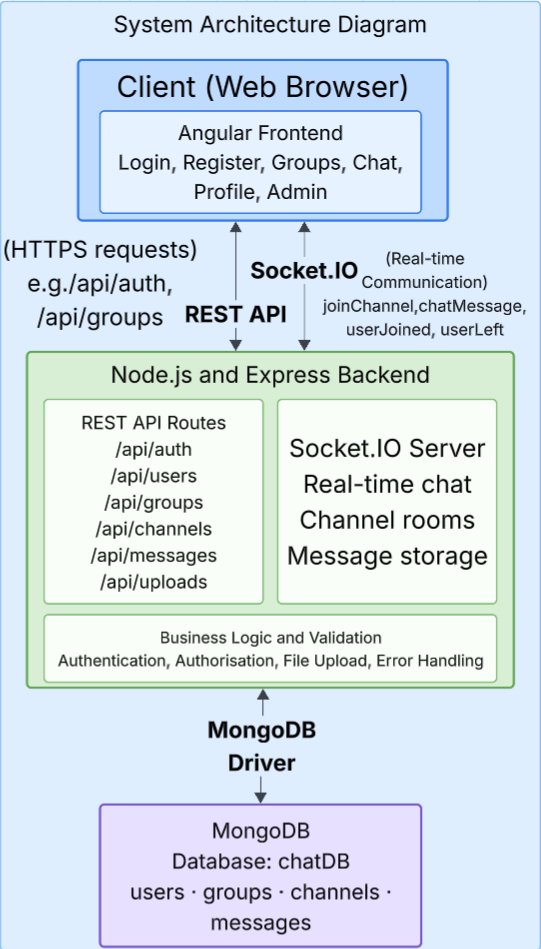
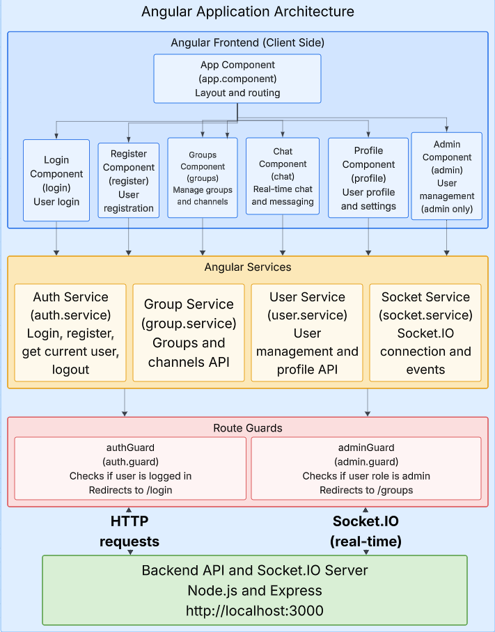

# Phase 2 – ChatSpace

**Name:** Yangzhe Lin  
**Student Number:** s5327758  
**Workshop:** Thursday 11:00a.m.
**GitHub Repository:** https://github.com/RoyL919/fullstack-phase2.git

---

## 1. Application Overview

ChatSpace is a web-based chat application developed using Angular, Node.js, Express, MongoDB and Socket.IO.

The application allows users to register an account, log in, work with groups and channels, and communicate with other users. Messages are sent in real time using Socket.IO and are also stored in MongoDB so previous messages can be loaded again.

The application also supports profile images, user descriptions, image messages and administrator functions.

---

## 2. Application Requirements

### 2.1 Functional Requirements

- Users can register a new account.
- Users can log in using a username and password.
- Users can log out of the application.
- Logged-out users cannot access protected application pages.
- Users can view available groups.
- Users can create groups.
- Users can select a group and view its channels.
- Users can create channels inside groups.
- Users can delete channels.
- Users can open a channel and view previous messages.
- Users can send real-time text messages.
- Users can send images in chat.
- Users can upload a profile image.
- Users can add and update a profile description.
- Administrators can access the Admin Panel.
- Administrators can view users.
- Administrators can change a user's role.
- Administrators can delete users.
- Normal users cannot access the Admin Panel.

### 2.2 Validation and Security Requirements

- Username and password are required.
- Username must contain between 3 and 20 characters.
- Username can only contain letters, numbers and underscores.
- Password must contain at least 6 characters.
- Duplicate usernames are rejected.
- Duplicate or empty group names are rejected.
- A channel requires a name and a valid group.
- User roles are restricted to supported values.
- Uploaded files must be supported image types.
- Uploaded images have a maximum size of 5 MB.
- Passwords are hashed before being stored in MongoDB.
- Administrator operations are protected by frontend and backend permission checks.

---

## 3. System Architecture

ChatSpace uses a client-server architecture with three main parts.

### 3.1 Angular Frontend

The Angular frontend is responsible for:

- displaying the user interface;
- collecting user input;
- performing frontend validation;
- communicating with the REST API;
- communicating with Socket.IO;
- controlling frontend routes; and
- protecting routes using Angular guards.

The frontend runs at:

`http://localhost:4200`

### 3.2 Node.js and Express Backend

The backend is responsible for:

- authentication;
- user management;
- group management;
- channel management;
- retrieving stored messages;
- image uploads;
- administrator permission checking;
- MongoDB communication; and
- Socket.IO real-time communication.

The backend runs at:

`http://localhost:3000`

### 3.3 MongoDB Database

The application uses the MongoDB database:

`chatDB`

The main collections are:

- `users`
- `groups`
- `channels`
- `messages`

### 3.4 System Architecture Diagram

The following diagram shows the overall architecture of ChatSpace and the communication between the Angular frontend, Node.js and Express backend, Socket.IO, and MongoDB.



*Figure 1. System architecture of the ChatSpace application.*

---

## 4. Data Structures

### 4.1 User

A user document stores account and profile information.

```json
{
  "_id": "ObjectId",
  "username": "roy",
  "password": "hashed password",
  "role": "user",
  "profileImage": "",
  "groups": [],
  "description": "User description"
}
```

The password is stored as a bcrypt hash instead of plain text.

The supported roles are:

- `user`
- `admin`

### 4.2 Group

```json
{
  "_id": "ObjectId",
  "name": "Group Name",
  "members": [],
  "createdAt": "Date"
}
```

The `members` array stores references to users.

### 4.3 Channel

```json
{
  "_id": "ObjectId",
  "name": "general",
  "groupId": "ObjectId",
  "createdAt": "Date"
}
```

The `groupId` links the channel to its parent group.

### 4.4 Message

```json
{
  "_id": "ObjectId",
  "channelId": "ObjectId",
  "username": "roy",
  "message": "Hello",
  "imageUrl": "",
  "profileImage": "",
  "timestamp": "Date"
}
```

The `channelId` links the message to a channel. A message can contain text, an image URL, or both.

---

## 5. REST API Documentation

The backend API uses the base URL:

`http://localhost:3000/api`

### 5.1 Authentication API

#### Register User

**Method:** `POST`  
**Endpoint:** `/api/auth/register`

Creates a new user account.

**Request body:**

```json
{
  "username": "newuser",
  "password": "test123"
}
```

**Validation:**

- Username and password must be valid text.
- Username is trimmed.
- Username must be 3-20 characters.
- Username can only contain letters, numbers and underscores.
- Password must be at least 6 characters.
- Username must not already exist.

A successful registration returns HTTP `201`.

#### Login

**Method:** `POST`  
**Endpoint:** `/api/auth/login`

Authenticates an existing user.

**Request body:**

```json
{
  "username": "roy",
  "password": "password"
}
```

An incorrect username or password returns HTTP `401`.

---

### 5.2 User API

#### Get All Users

**Method:** `GET`  
**Endpoint:** `/api/users`

Returns users stored in the database.

This is an administrator-protected endpoint. Passwords are excluded from returned user documents.

Possible responses include:

- `200` - users returned;
- `401` - authentication failed;
- `403` - user is not an administrator; and
- `500` - server error.

#### Change User Role

**Method:** `PUT`  
**Endpoint:** `/api/users/:id/role`

Changes a user's role.

**Request body:**

```json
{
  "role": "admin"
}
```

Accepted roles are:

- `user`
- `admin`

#### Delete User

**Method:** `DELETE`  
**Endpoint:** `/api/users/:id`

Deletes a user from MongoDB.

#### Update Profile Image

**Method:** `PUT`  
**Endpoint:** `/api/users/:id/profile-image`

Updates the URL of a user's profile image.

```json
{
  "profileImage": "http://localhost:3000/uploads/image.png"
}
```

#### Update Description

**Method:** `PUT`  
**Endpoint:** `/api/users/:id/description`

Updates the user's profile description.

```json
{
  "description": "Write something about yourself."
}
```

---

### 5.3 Group API

#### Get Groups

**Method:** `GET`  
**Endpoint:** `/api/groups`

Returns all groups.

#### Create Group

**Method:** `POST`  
**Endpoint:** `/api/groups`

```json
{
  "name": "New Group"
}
```

The server checks that the group name is not empty and that another group with the same name does not already exist.

#### Add User to Group

**Method:** `POST`  
**Endpoint:** `/api/groups/:groupId/members/:userId`

Adds a user to the group's members array.

#### Remove User from Group

**Method:** `DELETE`  
**Endpoint:** `/api/groups/:groupId/members/:userId`

Removes a user from the group's members array.

#### Delete Group

**Method:** `DELETE`  
**Endpoint:** `/api/groups/:id`

Deletes the selected group.

---

### 5.4 Channel API

#### Get All Channels

**Method:** `GET`  
**Endpoint:** `/api/channels`

Returns all channels.

#### Get Channels for a Group

**Method:** `GET`  
**Endpoint:** `/api/channels/group/:groupId`

Returns channels belonging to the selected group.

#### Create Channel

**Method:** `POST`  
**Endpoint:** `/api/channels`

```json
{
  "name": "general",
  "groupId": "MongoDB group ID"
}
```

The server checks that the specified group exists before creating the channel.

#### Delete Channel

**Method:** `DELETE`  
**Endpoint:** `/api/channels/:id`

Deletes a channel using its MongoDB ObjectId.

---

### 5.5 Message API

#### Get Channel Messages

**Method:** `GET`  
**Endpoint:** `/api/messages/:channelId`

Returns stored messages belonging to a channel.

Messages are sorted by timestamp so they are displayed in the correct order.

New real-time chat messages are sent using Socket.IO.

---

### 5.6 Upload API

#### Upload Image

**Method:** `POST`  
**Endpoint:** `/api/uploads`

The endpoint accepts one file using the form field:

`image`

Supported image types include:

- JPEG
- PNG
- GIF
- WebP

Maximum file size:

`5 MB`

Uploaded files are stored in the server uploads directory.

---

## 6. Socket.IO Documentation

Socket.IO is used for real-time communication between the Angular frontend and Node.js backend.

### 6.1 `joinChannel`

**Direction:** Client -> Server

Sent when a user enters a chat channel.

```json
{
  "channelId": "channel ID",
  "username": "roy"
}
```

The server adds the socket connection to the room identified by `channelId`.

### 6.2 `userJoined`

**Direction:** Server -> Client

Notifies other users that somebody joined the channel.

### 6.3 `chatMessage`

**Direction:** Client -> Server and Server -> Client

Used to send and receive real-time chat messages.

```json
{
  "channelId": "channel ID",
  "username": "roy",
  "message": "Hello",
  "imageUrl": "",
  "profileImage": ""
}
```

When the server receives a chat message, it:

1. identifies the channel;
2. creates a message object;
3. adds the current timestamp;
4. stores the message in MongoDB; and
5. emits the message to users in the channel.

### 6.4 `leaveChannel`

**Direction:** Client -> Server

Sent when a user leaves the current channel.

### 6.5 `userLeft`

**Direction:** Server -> Client

Notifies the remaining users that a user left the channel.

### 6.6 `disconnect`

Handles the client connection ending.

---

## 7. Angular Application Structure

The following diagram shows the main Angular components, services and route guards used in the ChatSpace frontend.



*Figure 2. Angular application architecture of ChatSpace.*

### 7.1 Components

#### Login

The `Login` component:

- accepts username and password;
- calls the authentication service;
- displays login errors; and
- navigates after successful login.

#### Register

The `Register` component:

- collects registration information;
- performs validation; and
- sends registration requests to the backend.

#### Groups

The `Groups` component:

- loads groups;
- selects a group;
- loads channels;
- creates groups;
- creates channels; and
- navigates to chat channels.

#### Chat

The `Chat` component:

- identifies the selected channel;
- loads existing messages;
- joins and leaves Socket.IO channels;
- displays real-time messages;
- sends text messages;
- uploads and sends images; and
- displays user profile images.

#### Profile

The `Profile` component:

- displays profile information;
- uploads profile images;
- displays the user role;
- displays the user description; and
- saves description changes.

#### Admin

The `Admin` component:

- loads users;
- changes user roles; and
- deletes users.

The route is protected using `authGuard` and `adminGuard`.

#### Dashboard

The project also contains a `Dashboard` component. The current main application flow uses the Groups and Chat interfaces.

### 7.2 Angular Services

#### Auth

The authentication service is responsible for:

- registration;
- login;
- storing and retrieving the current user;
- checking authentication state; and
- logout.

#### GroupService

`GroupService` communicates with group and channel REST endpoints.

#### UserService

`UserService` communicates with user-management endpoints.

#### SocketService

`SocketService` manages the Socket.IO client connection and real-time events.

### 7.3 Route Guards

#### `authGuard`

`authGuard` prevents unauthenticated users from opening protected pages.

Protected routes include:

- `/dashboard`
- `/admin`
- `/groups`
- `/chat/:channelId/:channelName`
- `/profile`

Unauthenticated users are redirected to `/login`.

#### `adminGuard`

`adminGuard` checks whether the current user's role is `admin`.

Normal users are redirected to `/groups`.

---

## 8. Design Documentation

No separate Phase 1 design document was produced. The following documentation describes the final implemented design of ChatSpace.

### 8.1 Main Application Flow

```text
Register / Login
       |
       v
     Groups
       |
       v
 Select Group
       |
       v
Select Channel
       |
       v
      Chat
```

Other user functions:

```text
Profile
  |
  +-- Profile Image
  +-- Description
  +-- Settings
  +-- Logout
```

Administrator functions:

```text
Admin Panel
    |
    +-- View Users
    +-- Change User Role
    +-- Delete User
```

### 8.2 Angular Structure

```text
Angular Components
  App
  Login
  Register
  Groups
  Chat
  Profile
  Admin
  Dashboard

Angular Services
  Auth
  GroupService
  UserService
  SocketService

Route Guards
  authGuard
  adminGuard
```

### 8.3 Database Relationships

```text
User
  +-- profile / role information

Group
  +-- members[] -> User ObjectIds
  +-- Channel
        +-- Message (linked using channelId)

Channel
  +-- groupId -> Group ObjectId
```

### 8.4 Interface Design

The main ChatSpace interface uses a three-column layout:

- **Left sidebar:** groups, administrator navigation and current user/settings area.
- **Middle sidebar:** channels belonging to the selected group.
- **Main panel:** channel header, real-time messages and message composer.

The Profile page provides profile information, profile image management and the user description.

The Admin page provides user-management functions for administrators.

---

## 9. Testing

### 9.1 Testing Methodology

Testing combined automated frontend tests, automated backend API tests, Cypress end-to-end tests and manual functional testing.

The automated test files are included in the GitHub repository.

The tools used were:

- **Vitest** for Angular frontend tests;
- **Mocha, Chai and Supertest** for Node.js backend API tests; and
- **Cypress** for browser-based end-to-end tests.

### 9.2 Automated Test Results

| Test Area | Tool | Tests | Result |
| --- | --- | ---: | --- |
| Angular frontend | Vitest | 14 | 14 passed |
| Backend API | Mocha, Chai, Supertest | 5 | 5 passed |
| End-to-end | Cypress | 3 | 3 passed |
| **Total** | | **22** | **22 passed** |

### 9.3 Backend Test Cases

| Test | Expected Result | Result |
| --- | --- | --- |
| Register without username | HTTP 400 | Passed |
| Username shorter than 3 characters | HTTP 400 | Passed |
| Username with invalid characters | HTTP 400 | Passed |
| Password shorter than 6 characters | HTTP 400 | Passed |
| Login with missing credentials | HTTP 400 | Passed |

### 9.4 Cypress E2E Test Cases

| Test | Expected Result | Result |
| --- | --- | --- |
| Display login page | Login interface is visible | Passed |
| Invalid login | HTTP 401 and remain on login page | Passed |
| Successful login | Navigate to Groups page | Passed |

### 9.5 Running Angular Tests

From the `frontend` directory:

```bash
npm install
npm test
```

Final result:

```text
Test Files  14 passed (14)
Tests       14 passed (14)
```

### 9.6 Running Backend Tests

From the `server` directory:

```bash
npm install
npm test
```

Final result:

```text
5 passing
```

### 9.7 Running Cypress Tests

The backend and frontend must both be running.

**Terminal 1 - Backend**

```bash
cd server
node server.js
```

**Terminal 2 - Frontend**

```bash
cd frontend
npm start
```

**Terminal 3 - Cypress**

```bash
cd frontend
npx cypress open
```

Select E2E Testing and run:

`chatspace.cy.ts`

Final result:

```text
3 passing
```

---

## 10. Security and Error Handling

### 10.1 Password Security

Passwords are hashed using bcrypt before they are stored in MongoDB.

The original password is not returned by the user-management API.

### 10.2 Administrator Access

Angular uses `adminGuard` to prevent normal users from opening the Admin page.

The Node.js backend also checks administrator permissions for protected user-management operations.

### 10.3 Input Validation

The application performs validation for important user input.

The server uses HTTP status codes including:

- `201` for successful creation;
- `400` for invalid input;
- `401` for failed authentication;
- `403` for insufficient permission;
- `404` when a resource cannot be found; and
- `500` for server-side failures.

### 10.4 File Upload Validation

Image uploads are restricted by file type and file size.

Supported types include JPEG, PNG, GIF and WebP.

The maximum upload size is 5 MB.

---

## 11. Technologies Used

- Angular
- TypeScript
- HTML
- CSS
- Node.js
- Express
- MongoDB
- Socket.IO
- Socket.IO Client
- bcrypt
- Multer
- Vitest
- Mocha
- Chai
- Supertest
- Cypress
- Git
- GitHub

---

## 12. Running the Application

MongoDB must be available locally.

The application uses:

`chatDB`

### 12.1 Start the Backend

```bash
cd server
npm install
node server.js
```

The backend runs at:

`http://localhost:3000`

### 12.2 Start the Frontend

Open another terminal:

```bash
cd frontend
npm install
npm start
```

The frontend runs at:

`http://localhost:4200`

Open the frontend address in a browser to use ChatSpace.